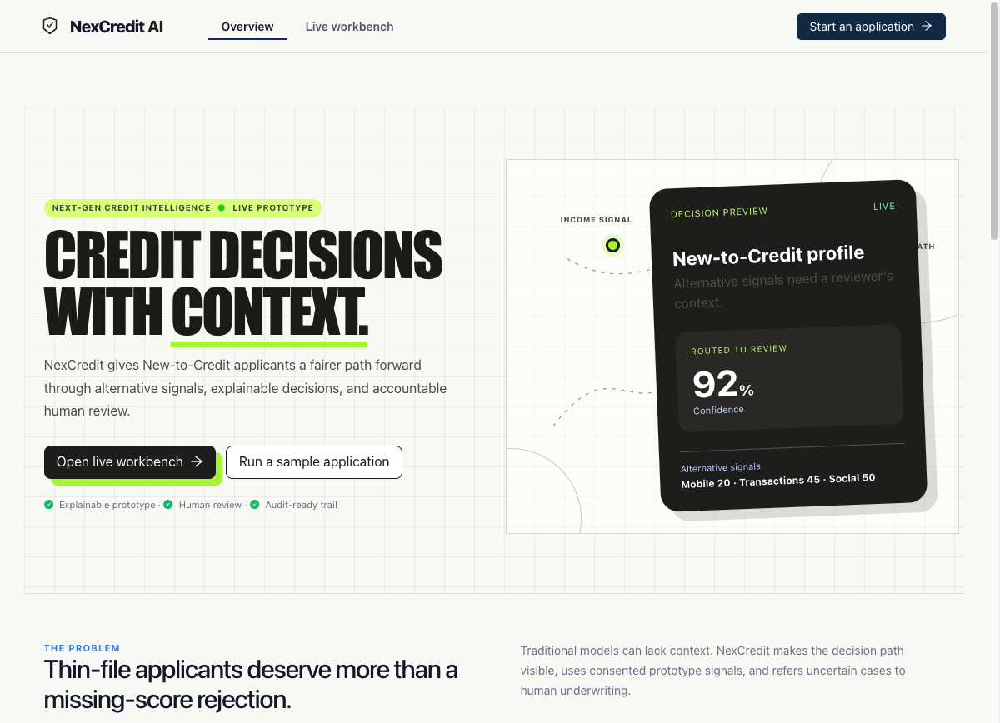
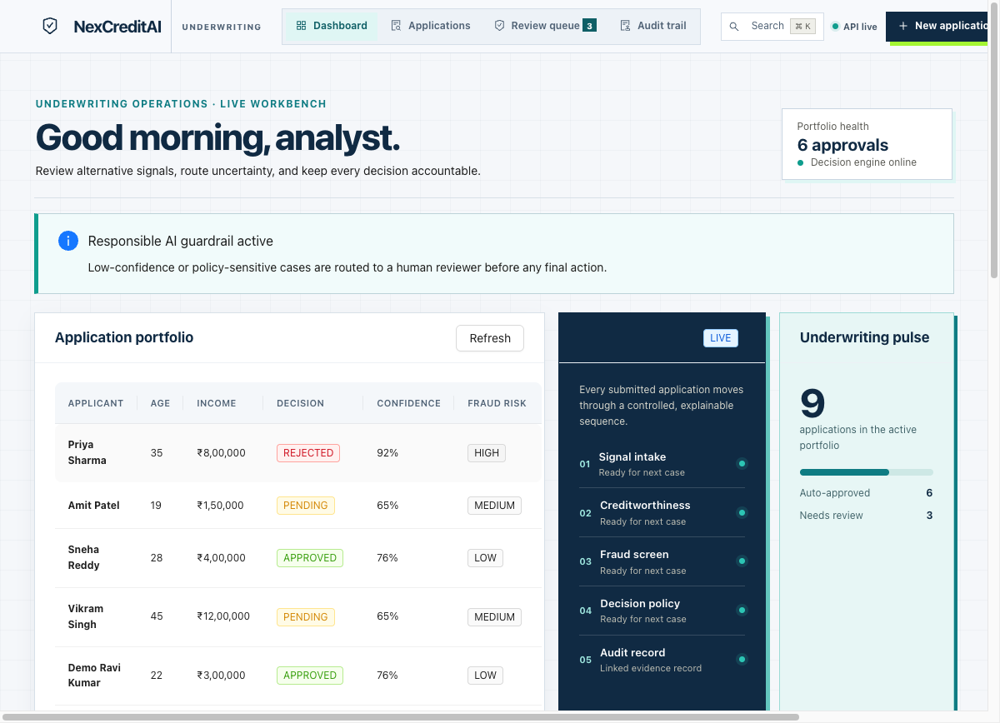
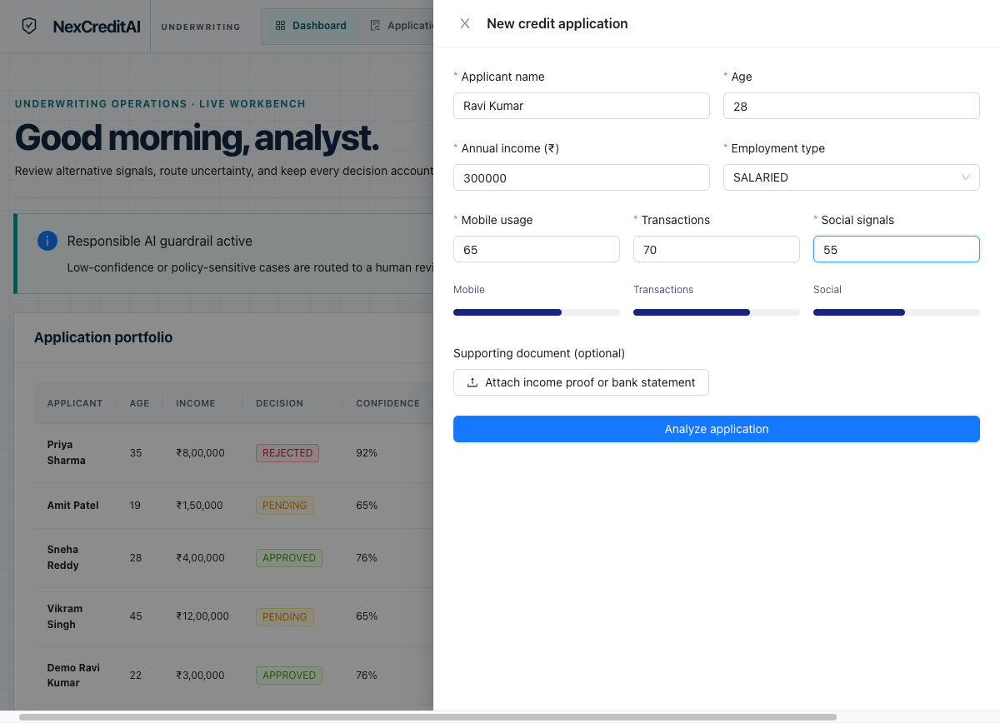
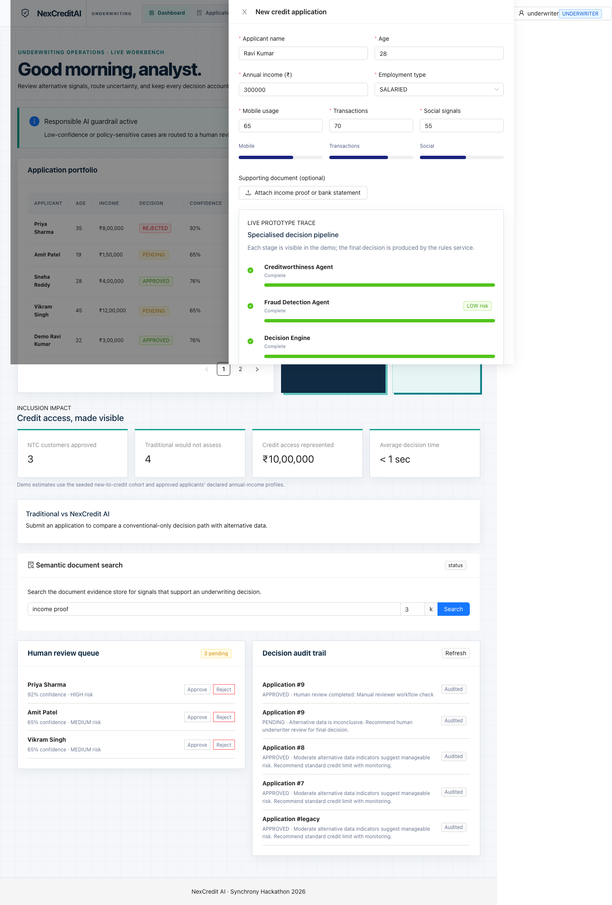
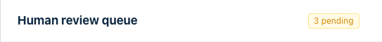
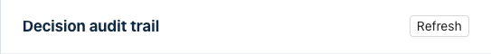
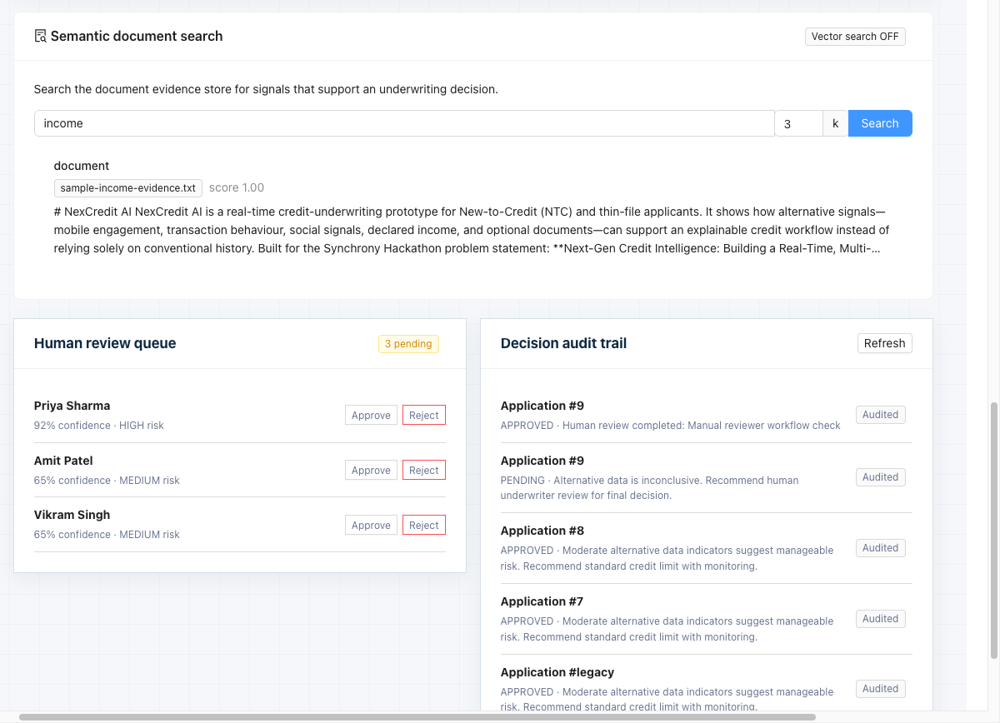

# NexCredit AI

> Real-time, multi-modal credit-underwriting prototype for New-to-Credit (NTC) and thin-file applicants.
> Built for **Synchrony Hackathon Problem Statement 3 (PB-3)**: *Next-Gen Credit Intelligence: Building a Real-Time, Multi-Modal Underwriting Engine*.

NexCredit AI shows how permitted alternative-data signals (mobile engagement, transaction behaviour, income, optional documents) can support an **explainable** credit workflow, instead of a black-box approve/reject. Every decision carries a stage trace, confidence, fraud context, a bias-aware escalation path, and a per-decision audit record.

- **Candidate roll number:** SE23UCSE065
- **Stack:** Spring Boot 3 (Java 17) and React 18 (Ant Design) and PostgreSQL and pgvector
- **Live repo:** `https://github.com/hrishikesh-reddi/synchrony-nexcredit`

---

## Screenshots

> Captured from a live local run (Spring Boot on `:8081`, React on `:3001`, pgvector on `:5435`).

### Landing page


### Underwriter workbench (dashboard / application portfolio)


### New credit application form


### Decision result (decision, confidence, fraud-risk, stage trace)


### Human review queue


### Decision audit trail


### Evidence (semantic document) search


## 1. Problem & approach (short)

Traditional underwriting leans on formal credit history, which excludes NTC / thin-file applicants. NexCredit combines consented alternative signals with a transparent decision policy, flags uncertainty or risk, and routes to a human reviewer with the evidence needed to make the final call. It is a **governed underwriting workbench**, not an autonomous approval bot.

## 2. Tech stack

| Layer | Choice |
| --- | --- |
| Backend | Spring Boot 3.3, Java 17, Spring MVC, Spring Data JPA, Spring Security |
| Auth | JWT (jjwt 0.12)   stateless, role-based (APPLICANT / UNDERWRITER / ADMIN) |
| Database | PostgreSQL 16 and **pgvector** (semantic document search) |
| AI layer | OpenAI-compatible REST (embeddings and chat) with deterministic local fallback; **off by default** |
| Frontend | React 18, Ant Design 5, Create React App build |
| Infra | Docker Compose (postgres and backend and frontend), Maven wrapper |

## 3. Repository layout

```
NexCredit-AI/
├── pom.xml                      # Maven build: Spring Boot, security, pgvector, jjwt, tests
├── Dockerfile                   # Multi-stage backend image (Maven build -> JRE run)
├── docker-compose.yml           # postgres(pgvector) and backend and frontend
├── build-submission.sh          # Packages submission/SE23UCSE065 as a roll-numbered ZIP
├── .env.example                 # Example Docker env (POSTGRES_PASSWORD)
├── .github/workflows/build.yml  # CI: JDK 17 and ./mvnw test
├── docs/                        # Long-form technical & hackathon narrative docs
├── submission/                  # SE23UCSE065/   the graded submission package (ID-named)
├── src/
│   ├── main/
│   │   ├── java/com/synchrony/nexcredit/   # Backend source (package com.synchrony.nexcredit)
│   │   └── resources/application.properties # Datasource, security, AI, vector config
│   ├── test/java/com/synchrony/nexcredit/  # JUnit 5 tests (14, all green)
│   └── frontend/                          # React app (src/frontend/src)
└── (gitignored) node_modules/ target/ build/ uploads/ .env
```

## 4. File-by-file guide

### 4.1 Root & build config
| File | Purpose |
| --- | --- |
| `pom.xml` | Backend dependencies & build. Profiles: default builds backend only; `bundle-backend-and-frontend` also builds the React app. Byte-Buddy 1.16.1 and surefire `--add-opens` keep tests green on JDK 24. |
| `Dockerfile` | Multi-stage: `maven:3.9-temurin-17` compiles the jar, `eclipse-temurin:17-jre` runs it on port 8080. |
| `docker-compose.yml` | Three services: `postgres` (`pgvector/pgvector:pg16`, host port **5433**), `backend` (port 8080), `frontend` (port 3000). |
| `build-submission.sh` | Creates `submission/SE23UCSE065.zip` from the README and the maintained `submission/SE23UCSE065/*.md` sources and a code snapshot. |
| `.env.example` | Template for `POSTGRES_PASSWORD` used by Docker Compose. |
| `.github/workflows/build.yml` | CI: checkout, JDK 17, `./mvnw -P'!bundle-backend-and-frontend' test`. |
| `.gitignore` | Excludes `node_modules/`, `target/`, `build/`, `uploads/`, `.env`, `.idea`, and the frontend-maven-plugin Node runtime. |

### 4.2 Backend   `src/main/java/com/synchrony/nexcredit/`
**Entry & health**
| File | Purpose |
| --- | --- |
| `NexCreditApplication.java` | `@SpringBootApplication` main class (entry point). |
| `HealthController.java` | `GET /api/health` liveness probe. |

**`credit/`   domain, underwriting, review, documents, audit**
| File | Purpose |
| --- | --- |
| `CreditApplication.java` | JPA entity: applicant fields and alternative-data signals (mobile, transaction, social, income, employment). |
| `CreditApplicationRepository.java` | Spring Data JPA repository for applications. |
| `CreditApplicationService.java` | CRUD, document storage, review workflow, seed data loading. |
| `CreditUnderwritingService.java` | Core decision engine: multi-stage scoring, confidence, fraud-risk, and the **age-sensitive bias guardrail** (routes rejected under-21 applicants to human review). |
| `CreditDecision.java` | Decision DTO: APPROVE / REVIEW / REJECT, confidence, stage trace, factor breakdown. |
| `CreditSeedData.java` | Loads sample NTC / thin-file applicants on startup. |
| `CreditController.java` | REST API (see §6). |
| `DocumentEvidence.java` | Entity: extracted document text and bounded preview and extraction status. |
| `DocumentEvidenceRepository.java` | JPA repo for document evidence. |
| `DocumentEvidenceService.java` | Apache Tika text extraction, bounded preview, and indexing into the vector store. |
| `AuditController.java` | `GET /api/audit/**` decision/audit history endpoints. |
| `AuditLog.java` / `AuditLogRepository.java` / `AuditLogService.java` | Per-decision audit record (who/when/what) for traceability. |
| `EmploymentType.java` / `ReviewStatus.java` | Enums (employment category; review outcome). |
| `ReviewRequest.java` | DTO for a reviewer's decision and notes. |

**`ai/`   embeddings, semantic search, LLM explanation**
| File | Purpose |
| --- | --- |
| `AiProperties.java` | `@ConfigurationProperties` for `nexcredit.ai.*` (enabled flag, base URL, model names, embedding dim). |
| `EmbeddingService.java` | Calls an OpenAI-compatible embedding endpoint; deterministic local fallback hash-embeddings when no key. |
| `VectorStore.java` | Manages the pgvector table, `<->` L2-distance search, startup reindex, and token-based fallback when pgvector is absent. |
| `ExplanationService.java` | Builds a plain-language decision explanation via LLM, with guardrails (`guardrailOk` / `sanitize`) and a rule-based fallback. Returns `aiPowered` flag. |
| `EvidenceSearchRequest.java` | Record: `query`, `k` (top-k). |
| `ExplanationResponse.java` | Record: decision summary, contributing factors, rationale, `aiPowered`. |
| `SearchHit.java` | Record: matched application id, text preview, similarity score. |

**`security/`   JWT auth**
| File | Purpose |
| --- | --- |
| `SecurityConfig.java` | Stateless filter chain, CORS, CSRF off; permits public endpoints, secures `/review/**` and `/upload/**` for UNDERWRITER/ADMIN. |
| `JwtUtil.java` | JWT create/parse (HS256, expiry from `nexcredit.security.jwt-expiration-ms`). |
| `JwtAuthenticationFilter.java` | Validates the `Authorization: Bearer` token on each request. |
| `AuthController.java` | `POST /api/auth/login`  to  returns JWT for username/password. |
| `AuthRequest.java` / `AuthResponse.java` | Login request/response records. |
| `UsersConfig.java` | In-memory users from `nexcredit.security.users` (underwriter / admin / applicant). |

**Resources**
| File | Purpose |
| --- | --- |
| `src/main/resources/application.properties` | Datasource (`${USER}`/`${DB_PASSWORD:}`), JWT secret (dev placeholder), AI flags, `nexcredit.vector.enabled`. |

### 4.3 Tests   `src/test/java/com/synchrony/nexcredit/`
| File | Purpose |
| --- | --- |
| `NexCreditApplicationTests.java` | Spring context load smoke test. |
| `HealthControllerTest.java` | `/api/health` returns 200. |
| `credit/CreditControllerTest.java` | 6 tests: analyze, applications, pending-review, review, upload, evidence/search, explanation. |
| `credit/CreditApplicationServiceTest.java` | Service-level save/review logic. |
| `credit/CreditUnderwritingServiceTest.java` | Scoring / decision outcomes. |
| `credit/CreditUnderwritingBiasGuardrailTest.java` | Under-21 rejection  to  REVIEW routing. |
| `credit/CreditSeedDataTest.java` | Seed data integrity. |
| `credit/DocumentEvidenceServiceTest.java` | Tika extraction and vector indexing with a mocked `VectorStore`. |

### 4.4 Frontend   `src/frontend/`
| Path | Purpose |
| --- | --- |
| `package.json` / `package-lock.json` | React 18 and Ant Design 5 deps; `npm start` (dev, proxy to :8081) / `npm run build`. |
| `.env` | Local API base URL: `REACT_APP_API_BASE_URL=http://localhost:8081`. |
| `public/` | `index.html`, favicon, manifest, logos (CRA default assets). |
| `src/index.js` | React entry; mounts `<App/>`, loads styles, reportWebVitals. |
| `src/App.js` | Workbench composition root: login, application portfolio, review queue, audit trail, and section navigation. Auto-logs in as the demo underwriter. |
| `src/OperationsBriefing.js` | Finance-grade operating-state ledger and expandable, explicitly disclosed production-orchestration concept preview. |
| `src/App.css` / `src/index.css` | Global and component styles. |
| `src/Client.js` | API client: attaches JWT, wraps `login`, `analyze`, `getApplications`, `getPendingReview`, `uploadDocument`, `searchEvidence`, `explainDecision`. |
| `src/CreditApplicationForm.js` | New-application form; submits for analysis; **Explain** button  to  LLM explanation. |
| `src/EvidenceSearchPanel.js` | Semantic document search UI  to  `POST /api/credit/evidence/search`. |
| `src/DecisionCard.js` | Renders a `CreditDecision` (stage trace, confidence, factors). |
| `src/DocumentScanPreview.js` | Bounded evidence preview and clearly-labelled scan simulation. |
| `src/FraudHeatmap.js` | Fraud-risk visualisation (prototype). |
| `src/RiskRadar.js` | Multi-dimension risk radar (prototype). |
| `src/ImpactMetrics.js` | Portfolio / inclusion impact metrics panel. |
| `src/TraditionalComparison.js` | Side-by-side vs traditional scoring. |
| `src/Notification.js` | Toast/notification helper. |
| `src/AgentPipeline.js` | Underwriting-stage pipeline visualisation. |
| `src/logo.svg`, `reportWebVitals.js`, `setupTests.js`, `App.test.js` | Assets / CRA test scaffolding. |
| `Dockerfile` / `nginx.conf` | Production frontend image (nginx serving the build on port 80). |

### 4.5 Infrastructure & misc
| Path | Purpose |
| --- | --- |
| `src/frontend/Dockerfile`, `nginx.conf` | Containerised React build served by nginx. |
| `docs/` | `architecture.md`, `pitch-context.md`, `roadmap.md`, `deck-generation-prompt.md` (long-form / hackathon narrative). |
| `submission/SE23UCSE065/` | The graded submission package (roll-numbered): `readme`, `pdf-source`, `deck-source`, `demo-script`, `panel-qa`, `compliance`. Replace with the generated ZIP for upload. |

## 5. How to run

**Option A   Docker (recommended, includes pgvector):**
```bash
cp .env.example .env            # set POSTGRES_PASSWORD
docker compose up --build       # postgres:5433, backend:8080, frontend:3000
```
Open http://localhost:3000 (backend at http://localhost:8080).

**Option B   Local dev:**
```bash
# Terminal 1   Postgres with pgvector on :5433 (Docker)
docker run -e POSTGRES_USER=admin -e POSTGRES_PASSWORD=admin -e POSTGRES_DB=creditdb \
  -p 5433:5432 pgvector/pgvector:pg16

# Terminal 2   Backend (uses your OS user as DB user)
export DB_PASSWORD=admin
./mvnw -P'!bundle-backend-and-frontend' spring-boot:run   # :8081

# Terminal 3   Frontend
cd src/frontend && npm install && npm start               # :3000 (proxies to backend)
```
Default users: `underwriter / underwriter123` (UNDERWRITER), `admin / admin123` (ADMIN), `applicant / applicant123` (APPLICANT).

**Remote AI calls** are off by default. To enable the optional explanation/embedding client, set
`NEXCREDIT_AI_ENABLED=true` and `OPENAI_API_KEY` for an OpenAI-compatible endpoint configured via
`OPENAI_BASE_URL`. Without a key, explanations remain deterministic and embeddings use a local
fallback; evidence search uses pgvector when available and token matching otherwise.

## 6. API surface

| Method | Path | Auth | Purpose |
| --- | --- | --- | --- |
| GET | `/api/health` | public | Liveness |
| POST | `/api/auth/login` | public | Username/password  to  JWT |
| POST | `/api/credit/analyze` | public | Run underwriting on an application  to  `CreditDecision` |
| GET | `/api/credit/applications` | public | All applications |
| GET | `/api/credit/pending-review` | public | Applications awaiting review |
| POST | `/api/credit/applications` | public | Create an application |
| POST | `/api/credit/review/{id}` | UNDERWRITER/ADMIN | Final reviewer decision |
| POST | `/api/credit/upload` | UNDERWRITER/ADMIN | Upload document  to  Tika extraction and vector index |
| GET | `/api/credit/evidence/{id}` | public | Latest document evidence for an application |
| POST | `/api/credit/evidence/search` | public | Semantic search across evidence (`query`, `k`) |
| POST | `/api/credit/explanation` | public | Plain-language explanation of a decision |
| GET | `/api/audit/**` | public | Audit history |

## 7. Responsible-AI posture (honest scope)

- **Explainable, not autonomous:** decisions are inspectable (stage trace, confidence, factors) and final approval rests with a human reviewer.
- **Bias guardrail:** age-sensitive logic routes rejected under-21 applicants to review rather than auto-declining.
- **No real CIBIL / device / location data:** the prototype uses consented, synthetic alternative signals; it is a demonstration, not a production risk model.
- **Graceful degradation:** pgvector and LLM features fall back to local/rule-based paths when unavailable; the app never hard-fails.
- **Auditability:** every decision is logged for review and traceability.

## 8. Where to look next

- Architecture deep-dive: `docs/architecture.md`
- Pitch narrative: `docs/pitch-context.md`
- Engineering roadmap: `docs/roadmap.md`
- Submission package: `submission/SE23UCSE065/`
