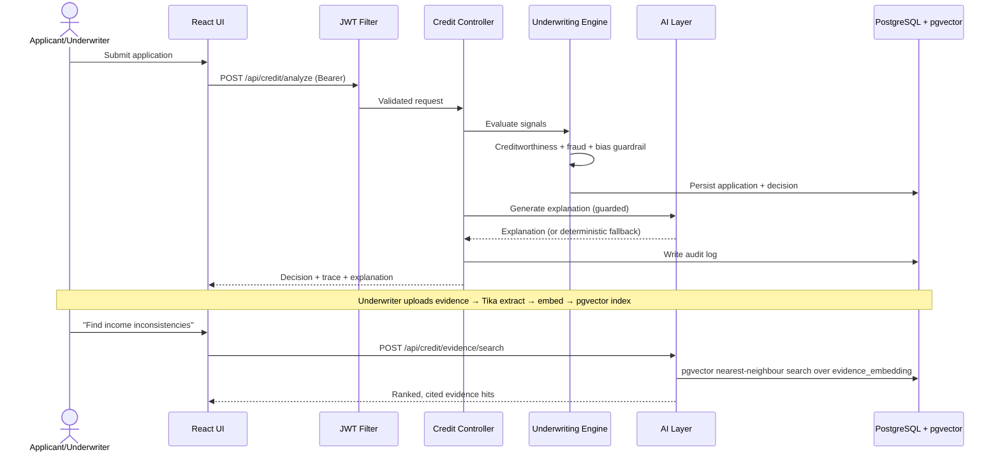

# NexCredit AI
## Next-Gen Credit Intelligence: A Real-Time, Multi-Modal Underwriting Engine

**Submission for the Synchrony Hackathon**
**Candidate roll number:** SE23UCSE065
**Selected challenge:** Problem Statement 3 (PB-3) — Next-Gen Credit Intelligence: Building a Real-Time, Multi-Modal Underwriting Engine

> This report is the written companion to the planned roll-numbered source/demo package and
> pitch deck. It is structured to map 1:1 to the judging rubric:
> problem → approach → insights → solution → code → evidence → responsible AI → roadmap.

---

## 1. Problem statement

Traditional credit underwriting leans heavily on formal credit history (e.g. bureau scores).
That systematically excludes **New-to-Credit (NTC)** and thin-file applicants — gig workers,
students, recent immigrants — who may be creditworthy but lack the paper trail. At the same
time, lenders face two pressures: (a) **expand access responsibly**, and (b) **make decisions
explainable and auditable** under growing AI-governance expectations.

Problem Statement 3 asks for a *real-time, multi-modal underwriting engine*. We interpret
"multi-modal" as combining **structured alternative-data signals** (income, employment,
mobile-usage, transaction-behaviour, social signals) with **unstructured document evidence**
(uploaded income/identity proofs) through a **semantic retrieval + LLM explanation** layer —
all behind **role-based security** and an **explainability/guardrail** framework.

### The core tension we design around
- Include more applicants **without** lowering underwriting discipline.
- Use AI for **explanation and retrieval**, not as an unaccountable black-box approver.
- Keep every decision **traceable** to inputs, rules, and a human reviewer.

---

## 2. Approach

We built a layered prototype, **API-first**, with strict separation between:
1. **Presentation** (React/Ant Design, role-aware),
2. **API & business logic** (Spring Boot),
3. **Persistence** (PostgreSQL + pgvector),
4. **Evidence and optional AI layer** (Tika extraction, embeddings, semantic search, and a guarded LLM explanation path),
5. **Security** (JWT, role-based authorization),
6. **Governance** (audit trail, bias guardrail, human-review queue).

Design decisions, in priority order:

| Decision | Rationale |
| --- | --- |
| Deterministic rules **first**, LLM **second** | The score/decision must be reproducible and auditable; the LLM only *explains* |
| AI layer **offline by default** with fallback | Submission must run with zero secrets/keys; LLM is an enhancer, not a dependency |
| pgvector with **text fallback** | Even without the `vector` extension, evidence search still works |
| JWT + roles | Demonstrates real authn/authz, the highest production-readiness gap in typical student builds |
| Every decision → **audit log + review route** | Satisfies explainability, transparency and responsible-AI requirements |

---

## 3. Key insights & findings

1. **Explainability beats a bare outcome for trust.** A reviewer needs to see *why*. Our UI shows an
   animated representation of the server-side workflow
   (creditworthiness → fraud → decision → explanation → audit) rather than a single label.
2. **Guardrails must live in code, not just prompts.** We enforce them server-side
   (`guardrailOk()` + `sanitize()`), because a prompt alone is not a security control.
3. **Graceful degradation is a feature.** When the LLM or vector DB is unavailable, the system
   still returns a deterministic, transparent explanation and a text-based evidence search.
   This makes the demo robust and signals production maturity.
4. **Role-gated actions map to real lending ops.** The prototype provisions `APPLICANT`,
   `UNDERWRITER`, and `ADMIN` identities; review and upload actions are restricted to
   `UNDERWRITER`/`ADMIN`. Full per-applicant data isolation is a production hardening item.
5. **Semantic search over evidence changes the review experience.** An underwriter can ask
   "show me documents that mention inconsistent monthly income" and retrieve relevant evidence
   by meaning, not just keyword — a real efficiency gain.

---

## 4. Proposed solution — architecture

### 4.1 High-level architecture (C4-style, level 1–2)

```text
┌──────────────────────────────────────────────────────────────────────┐
│                           NexCredit AI Platform                        │
│                                                                        │
│   ┌────────────────────┐         ┌──────────────────────────────────┐  │
│   │  React Frontend    │  HTTPS  │        Spring Boot API            │  │
│   │  (Ant Design,      │ ──────▶ │  ┌────────────────────────────┐  │  │
│   │   role-aware UI)   │ ◀────── │  │ Spring Security (JWT, RBAC)│  │  │
│   └────────────────────┘  JWT    │  └────────────┬───────────────┘  │  │
│                                  │    ┌───────────┴───────────┐      │  │
│                                  │    │  Underwriting Engine  │      │  │
│                                  │    │  (rules + bias guard) │      │  │
│                                  │    └───────────┬───────────┘      │  │
│                                  │    ┌───────────┴───────────┐      │  │
│                                  │    │  AI Layer             │      │  │
│                                  │    │  EmbeddingService     │      │  │
│                                  │    │  VectorStore(pgvector)│      │  │
│                                  │    │  ExplanationService   │      │  │
│                                  │    └───────────┬───────────┘      │  │
│                                  │    ┌───────────┴───────────┐      │  │
│                                  │    │  Audit + Review Queue │      │  │
│                                  │    └───────────┬───────────┘      │  │
│                                  └────────────────┼─────────────────┘  │
│                                                   │                    │
│                                  ┌────────────────┴─────────────────┐  │
│                                  │  PostgreSQL  │  pgvector          │  │
│                                  │  creditdb    │  evidence_embedding│  │
│                                  └──────────────────────────────────┘  │
└──────────────────────────────────────────────────────────────────────┘
```

### 4.2 Request / data flow (Mermaid)



### 4.3 Component map → rubric

| Rubric area | Component |
| --- | --- |
| Frontend | `src/frontend` (React + Ant Design) |
| Backend API | `credit/*` controllers & services (Spring Boot) |
| PostgreSQL (structured) | `CreditApplication`, `AuditLog`, `DocumentEvidence` JPA entities |
| PostgreSQL + pgvector | `ai/VectorStore.java` (`CREATE EXTENSION vector`, L2-distance search) |
| Optional AI / LLM | `ai/ExplanationService.java` (OpenAI-compatible; native Bedrock adapter is roadmap) |
| Embeddings | `ai/EmbeddingService.java` (API + deterministic local fallback) |
| Prompt templates & guardrails | System prompt + `guardrailOk()`/`sanitize()` |
| Security | `security/*` (JWT, BCrypt, RBAC) |
| Responsible AI | Bias guardrail → review, audit trail, simulation labels, disclaimers |

---

## 4.4 Frontend / user experience (what the judge actually sees)

The UI is a polished, two-surface React workbench (Ant Design) — not a bare form:

**Landing page** — value proposition, the problem statement ("thin-file applicants deserve
more than a missing-score rejection"), a 4-step "project briefing" pitch map (signal intake →
decisioning API → guardrails & review → evidence & accountability), and a capability matrix that
honestly splits *live in prototype* vs *production extensions*.

**Live workbench** (after "Open live workbench") has tabbed navigation:
- **Dashboard** — portfolio table (applicant, age, income in ₹, decision tag, confidence, fraud
  risk), a live **decision trace** (Signal intake → Creditworthiness → Fraud screen → Decision
  policy → Audit record), and an "Underwriting pulse" approval/review gauge. A persistent
  *Responsible-AI guardrail active* banner reinforces the human-review posture.
- **Applications** — the full application portfolio.
- **Review queue** — cases in `PENDING_REVIEW` with one-click Approve/Reject by an
  `UNDERWRITER`/`ADMIN`; actions write reviewer notes and append to the audit trail.
- **Audit trail** — every decision lineage (application id, decision, reasoning, "Audited" tag).
- **Insight panels** — `ImpactMetrics` (NTC inclusion), `TraditionalComparison` (illustrative
  conventional-vs-NexCredit), `RiskRadar`, `FraudHeatmap`, `EvidenceSearchPanel` (the pgvector
  semantic search UI), `DocumentScanPreview` (labelled simulation), and `AgentPipeline` (the
  staged underwriting flow).

Auth is wired in-UI: a login dialog issues a JWT and shows the active role tag. The primary demo
login is `underwriter / underwriter123`; applicant and admin roles are also configured. This makes
the **security layer visible**, not just present.

---

## 5. Code approach (key modules)

### 5.1 Underwriting engine (deterministic, explainable)
`CreditUnderwritingService` combines alternative-data signals into a creditworthiness score,
runs a fraud check, applies the **age-sensitive bias guardrail**, and emits a structured
`CreditDecision` with a plain-language `reasoning` string and `confidenceScore`.
Decisions are one of `APPROVE`, `REJECT`, or `REVIEW`.

### 5.2 Security — JWT + RBAC (`security/*`)
- `AuthController.login` authenticates via Spring Security and returns a signed JWT
  (HS256, `roles` claim).
- `JwtAuthenticationFilter` validates the bearer token on every request.
- `SecurityConfig` enforces endpoint-level roles: review/upload require `UNDERWRITER`/`ADMIN`.
- Passwords hashed with `BCryptPasswordEncoder`; secrets sourced from environment variables.

```java
// security/SecurityConfig.java (excerpt)
.requestMatchers("/api/credit/review/**", "/api/credit/upload/**")
    .hasAnyRole("UNDERWRITER", "ADMIN")
.anyRequest().authenticated()
```

### 5.3 Semantic evidence search — pgvector (`ai/VectorStore.java`)
On startup (when enabled and the `vector` extension is present) it creates
`evidence_embedding(id, source, type, content, embedding vector(1536))` and reindexes existing
evidence. The current SQL uses pgvector's `<->` L2-distance operator, converts that distance to a
display score, and falls back to token-based text matching if the vector store is unavailable.

```java
// ai/VectorStore.java (excerpt)
"SELECT id, source, type, content, 1 - (embedding <-> ?::vector) AS score " +
"FROM evidence_embedding ORDER BY embedding <-> ?::vector LIMIT ?"
```

### 5.4 Explanation service with an optional guarded LLM (`ai/ExplanationService.java`)
`POST /api/credit/explanation` returns a plain-language explanation. By default, it uses a
deterministic fallback derived from the already-computed policy decision. When explicitly enabled
with a key, the service calls an OpenAI-compatible `/chat/completions` endpoint with a fixed system prompt that
forbids revealing internal logic, inventing facts, discriminating, or following
instructions embedded in data. Output is checked by `guardrailOk()` (rejects
"ignore previous", "jailbreak", etc.) and `sanitize()` before being returned with a
**disclaimer**. Any failure → deterministic `fallbackExplanation`.

```java
if (props.isEnabled() && props.getApiKey() != null && !props.getApiKey().isBlank()) {
    String text = callModel(app, decision);
    if (guardrailOk(text)) return new ExplanationResponse(sanitize(text).trim(), true, DISCLAIMER);
}
return new ExplanationResponse(fallbackExplanation(app, decision), false, DISCLAIMER);
```

### 5.5 Configuration (no hardcoded secrets)
All sensitive values are environment-driven:

```properties
nexcredit.security.jwt-secret=${JWT_SECRET:dev-secret}
nexcredit.ai.api-key=${OPENAI_API_KEY:}
nexcredit.ai.enabled=${NEXCREDIT_AI_ENABLED:false}
nexcredit.vector.enabled=${NEXCREDIT_VECTOR_ENABLED:true}
```

---

## 6. Evidence of working solution

- **Build & tests:** the verified backend suite contains **14 tests** including
  `CreditUnderwritingBiasGuardrailTest`, `CreditUnderwritingServiceTest`, `VectorStore` paths,
  and `DocumentEvidenceServiceTest`; frontend `CI=true npm test` + `npm run build` pass.
- **Demo flow to record and verify before packaging:**
  1. Dashboard of seeded NTC applicants + inclusion metrics.
  2. Create a Gig-Worker profile (mobile 85 / txn 80 / social 70) → transparent APPROVE.
  3. Stage trace: creditworthiness → fraud → decision → explanation → audit.
  4. Under-21 / low-confidence profile → bias guardrail routes to **human review**.
  5. Underwriter logs in (JWT), uploads income evidence → Tika extraction → pgvector index.
  6. Semantic search: "inconsistent monthly income" retrieves the relevant evidence chunk.
  7. `POST /api/credit/explanation` returns a deterministic explanation and disclaimer in the
     default configuration; if optional AI is enabled, the response also identifies it with
     `aiPowered: true`.
  8. Audit log shows the full decision lineage.

---

## 6.1 Scope honesty — live vs roadmap

To keep the submission credible, we separate what the prototype demonstrably does from what a
production system would require.

| Capability | Status in this submission |
| --- | --- |
| Alternative-data application workflow (React) | ✅ Live |
| Explainable decision + confidence + reasoning | ✅ Live |
| Fraud-risk label + age-sensitive bias guardrail → human review | ✅ Live |
| JWT authn + RBAC (APPLICANT/UNDERWRITER/ADMIN) | ✅ Live |
| Document upload + Tika extraction + bounded preview | ✅ Live |
| pgvector nearest-neighbour evidence search (with text fallback) | ✅ Live |
| Deterministic explanation endpoint + optional guarded LLM path | ✅ Implemented; optional AI is off by default |
| Audit trail + review queue | ✅ Live |
| 14 backend tests + frontend test/build | ✅ Verified |
| AWS Bedrock specifically invoked | ❌ Not called; a Bedrock adapter is a roadmap item |
| Live bureau/device/location data | ❌ Simulated/illustrative |
| OCR + field-verification governance | ❌ Roadmap |
| Managed cloud deploy + monitoring | ❌ Roadmap (Docker dev only) |
| Formal fairness evaluation at scale | ❌ Roadmap |

## 7. Responsible-AI & security posture

We treat this as a **decision-support** system, never an autonomous approver.

- **Human-in-the-loop:** uncertain, high-risk, or policy-sensitive (e.g. under-21) cases are
  routed to a human-review queue; the LLM only explains, it does not decide.
- **Guardrails in code:** prompt constraints + server-side `guardrailOk`/`sanitize` defend
  against prompt injection from applicant-supplied data.
- **Transparency:** every decision carries reasoning, confidence, and an audit record; the
  visual fraud-signal and document-scan previews are explicitly labelled *prototype simulations*.
- **Data handling:** secrets are env-injected (none committed); uploads are name-normalised and
  size-capped (10 MB); extracted text is bounded and stored as reviewer-only evidence.
- **Fairness awareness:** the age guardrail is a deliberate bias-control; production would add
  formal fairness evaluation, consented data provenance, and model monitoring.
- **Honest limitations:** no live bureau/device/location data; Bedrock is not invoked and requires
  a future native adapter; document intelligence is local extraction + semantic index,
  not OCR governance.

---

## 8. Roadmap

| Phase | Item |
| --- | --- |
| Near-term | Add a native **AWS Bedrock** adapter (Titan/Claude); tighten CORS and add refresh tokens |
| Governance | Consent management, data-source provenance, immutable (append-only) audit store |
| Fairness | Automated fairness metrics, reason-code policy controls, bias monitoring dashboards |
| Data | Real document OCR + field verification; streaming real-time fraud signals via event pipeline |
| Scale | Kubernetes/ECS deploy, managed RDS with pgvector, centralized logging/monitoring (CloudWatch) |
| Compliance | Model card, risk assessment, regulatory review before any production use |

---

## 9. How to run (summary)

Prerequisites: Java 17+, Node/npm, PostgreSQL **with the `vector` extension**.

```bash
# Backend
SERVER_PORT=8081 SPRING_DATASOURCE_URL=jdbc:postgresql://localhost:5432/creditdb \
SPRING_DATASOURCE_USERNAME="$USER" ./mvnw -P'!bundle-backend-and-frontend' spring-boot:run

# Frontend
cd src/frontend && npm install && PORT=3001 npm start   # http://localhost:3001

# Optional: enable LLM (no key committed; falls back if absent)
export NEXCREDIT_AI_ENABLED=true OPENAI_API_KEY=... 
```

Full instructions, API table, and architecture are in `README.md`.

---

*NexCredit AI — a transparent, secure, multi-modal underwriting prototype built for the
Synchrony Graduate Hackathon. Not a production lending system.*
